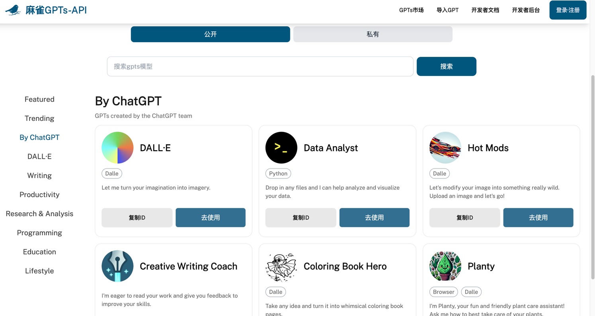
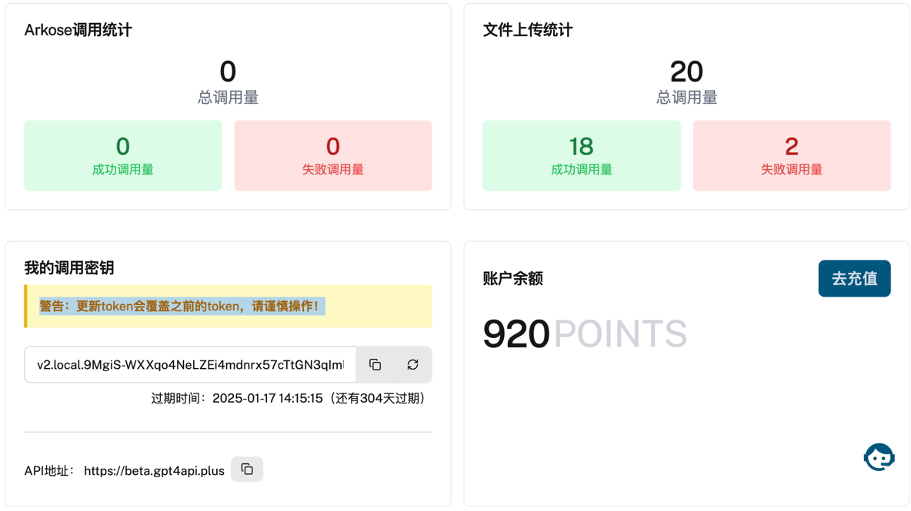

# 麻雀GPTs-4免费畅享计划：智慧白嫖

- 麻雀官方地址: [https://gpt4api.shop](https://gpt4api.shop)
- GITHUB地址: [https://github.com/gpt4api9](https://github.com/gpt4api9)
- Discord地址: [https://discord.com/invite/qYTrxQYTMr](https://discord.com/invite/qYTrxQYTMr)
- 服务状态监控：[https://status.gpt4api.plus](https://status.gpt4api.plus)

# 麻雀GPTs-API介绍

麻雀GPTs-API项目是一个非开源项目，但是可以免费让大家每天免费使用gpt-3.5-turbo约10000次调用。同时支持多模态,GPT-4,GPTs模型市场调用，
支持多种模型比如：Dalle-3,代码解释器，上网等功能。价格便宜，性能强大，欢迎大家使用。**服务有一定的稳定性，不保证100%稳定。**



# 如何每日10000免费GPT-3.5 Turbo API调用？

[访问官网注册登录页面](https://gpt4api.shop)，注册完成后。可以在[个人控制台页面](https://gpt4api.shop/console)看到**调用密钥**。(警告：更新token会覆盖之前的token，请谨慎操作！)
同时该页面也能看到**剩余调用次数**，**调用次数**，**调用失败次数**等相关信息。但是GPT-3.5 Turbo每日免费调用次数不会统计。这里请大家放心。



下面言归正传，开始**手把手教大家如何免费白嫖 GPT-3.5-turbo**。即使额度用完了，也可以**免费调用GPT-3.5-turbo**模型。

**注意了：GPT-4的API地址与GPT-3.5-turbo的API地址不一样。**

```http request
POST https://g3.gpt4api.plus/backend-api/conversation
Content-Type: application/json
Authorization:  <控制台秘钥>

{
  "messages": [
    {
      "content": {
        "content_type": "text",
        "parts": [
          "你是gpt-3还是4?"
        ]
      }
    }
  ]
}
```

# 如何使用GPTs或GPT-4V等其他模型呢？

那就好好查看[官方文档](https://docs.gpt4api.shop/)吧，里面有详细的API调用说明。

# 如何接入自定义API，通过Action控制GPT?

那就好好查看[官方文档](https://docs.gpt4api.shop/)吧，里面有详细的API调用说明。


# 如何支持批量GPT-4等模型调用呢?

- [点击下载编译可执行文件](https://github.com/gpt4api9/gpt4batch/releases)

# 如何获取更多GPT-4或GPT-3.5-turbo调用次数？

- 1.可以邀请好友注册，每邀请一个好友注册成功，你和你的好友都会获得额外的调用次数。
- 2.可以在[GITHUB](https://github.com/gpt4api9)点赞送小星星哦，每点赞一次，你都会获得额外的调用次数。
- 3.可以购买调用次数，价格便宜，性能强大。
